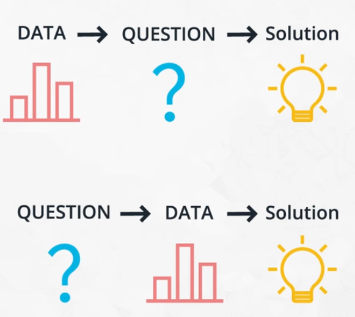
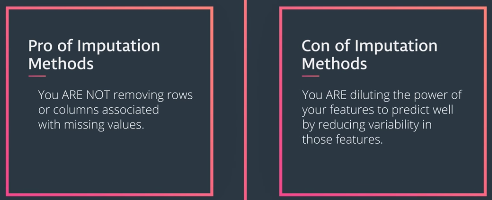

# Introduction

This Repo is about the process used for many data science problems. This will serve us as a useful guide on how to approach future data science problems.
 
Given the large number problems that fall under the umbrella of Data Science and there are a lot of different tools and individual nuances of  a particular company or industry for finding solutions. 

However, there's actually a common process used to find many solutions in Data Science. This process is known as the **Cross Industry Standard Process for Data Mining or CRISP-DM**. This process has been an industry standard for analyzing data for years and it has six major phases. 

##
1. Developing business understanding. 
2. Developing data understanding. 
3. Preparing the data to be analyzed. 
4. Modeling the data. 
5. Evaluating the results to answer the questions of interest 
6. Deploying changes based on the results of the analysis. 

##
I will look at each of these phases a bit closer in upcoming sections.

## 1. Business & Data understanding

In this section I am going to take a look at the first two steps of the CRISP-DM process in a bit more detail. First, CRISP-DM says I need business understanding, meaning understanding the problem. For examples each of these questions falls under business understanding. 

* Are you interested in acquiring new customers? 
* Are you interested in assessing of a new cancer treatment outperforms existing treatments? 
* Are you interested in finding a better way to communicate? 

The second step of the CRISP-DM process is data understanding. This means I need to gain an understanding of the data necessary to answer the question. Sometimes I might have a mountain of data at my disposal that I need to dig through to find insights. 

Other times I may need to collect data, which means I will have to understand what kind of data I'll be able to provide with the insights I need (meaning to answer the question I should collect data). This is often difficult to know ahead of time, which is why businesses tend to collect all the data they can first, so they can later identify which data they need to use to find their insights. 

throughout this repo, I will get hands-on practice with two datasets from Stack Overflow developer survey results, from 2017. [This dataset](https://github.com/A2Amir/Data-Science-Process/blob/master/Code/survey_results_public.csv) can provide some insight to developers around the world and get an idea of their experiences. Anything from their advice to other developers, to how they learn new skills, to where they live, or what programming languages they use, can all be understood from this dataset.

## Business & Data Understanding – Example

In the rest of this Repo I will be using the following business questions and Stackoverflow survey data to to answer these questions.
##### Business Questions

1.	what do those employed in industry suggest to help others enter the field? (How do I break into the field?)
2.	What are the placement and salaries of those who attended a coding bootcamp?
3.	How well can we predict an individual's salary? What aspects correlate well to salary?
4.	How well can we predict an individual's job satisfaction? What aspects correlate well to job satisfaction?

##### Data Understanding

I will be using the Stackoverflow survey data to get some insight into each of these questions. In order to get a better understanding of the data you can take a look at some of the characteristics of the datasets by checking [this exercise](https://github.com/A2Amir/Data-Science-Process/blob/master/Code/A%20Look%20at%20the%20Data.ipynb). 

## 2. Data Preparation: Gathering & Wrangling

In the previous section were introduced the four questions that I will focus on while working on the remaining steps in the CRISP-DM process. 

The next step in the process is about gathering the data and organizing it in a way that will allow us to answer our business questions. Fortunately Stack Overflow already gathered the data. The wrangling and gathering  process is said to be the most time-consuming, often taking 80 percent of the data analysis process. 

* First, check [this exercise](https://github.com/A2Amir/Data-Science-Process/blob/master/Code/How%20To%20Break%20Into%20the%20Field.ipynb) to take a look at the datasets and see how I might answer the first question about how to break into the field of becoming a developer according to the survey results. 

* Then check this [exercise](https://github.com/A2Amir/Data-Science-Process/blob/master/Code/Bootcamps.ipynb) to see how I answered the second question about the placement and salaries of those who attended a coding bootcamp.

* Third, in this [notebook](https://github.com/A2Amir/Data-Science-Process/blob/master/Code/Job%20Satisfaction.ipynb), I am going to look at  job satisfaction according to the survey results.

As you may have already noticed from answering the first two questions, not every data science problem involves the fanciest deep learning or machine learning algorithm.In the [first](https://github.com/A2Amir/Data-Science-Process/blob/master/Code/How%20To%20Break%20Into%20the%20Field.ipynb) [two](https://github.com/A2Amir/Data-Science-Process/blob/master/Code/Bootcamps.ipynb) nootbooks I only used descriptive and a little inferential statistics to retrieve the results.

Therefore, all steps of CRISP-DM were not necessary for these first two questions. CRISP-DM states 6 steps:

1. Business Understanding
2. Data Understanding
3. Prepare Data
4. Data Modeling
5. Evaluate the Results
6. Deploy

For these first two questions, I did not need step 4. In this [notebooks](https://github.com/A2Amir/Data-Science-Process/blob/master/Code/How%20To%20Break%20Into%20the%20Field.ipynb), I performed steps 3 and 5 without needing step 4 at all. A lot of the hype in data science, artificial intelligence, and deep learning is integrated into step 4, but there are still plenty of questions to be answered not using machine learning, artificial intelligence, and deep learning.

**All Data Science Problems Involve**

1.	Curiosity.
2.	The right data.
3.	A tool of some kind (Python, Tableau, Excel, R, etc.) used to find a solution (You could use your head, but that would be inefficient with the massive amounts of data being generated in the world today).
4.	Well communicated or deployed solution.

**Extra Useful Tools to Know But That Are NOT Necessary for ALL Projects**

5. Deep Learning
6. Fancy machine learning algorithms

With that, you will be getting a more in depth look at these items, but it is worth mentioning (given the massive amount of hype) that they do not solve all the problems. Deep learning cannot turn bad data into good conclusions. Or bad questions into amazing results.

# 3. Modeling

By solving the first two questions, I understood I did not need to do any predictive modeling. I only used descriptive and a little inferential statistics to retrieve the results. Therefore, all steps of CRISP-DM were not necessary for these first two questions.
However, for the last two questions:

1.	How well can we predict an individual's salary? What aspects correlate well to salary?
2.	How well can we predict an individual's job satisfaction? What aspects correlate well to job satisfaction?

I will need to use a predictive model. I will need to pick up at step 3 to answer these two questions. Predictive models are one type of machine learning algorithm, known as supervised machine learning. A simplified four-step process for modeling using scikit-learn is to 

* First instantiate the model. 
* Second, to fit the model to the training data. 
* Third, predict using the fitted model on some test data 
* Finally score the model using a metric to evaluate how well it performs. 

I use modelling to predict salary for an individual in this dataset but a quick look through the dataset shows a number of factors that should be able to help me better understand more about an individual salary. 

They're **quantitative factors** like:
 
* The number of hours a week and individual works 
* How satisfied they are with their job or their career. 

They're also **categorical factors** like:
 
* The country they live in 
* Their company size 
* Their formal education. 

When building supervised machine learning models, I am looking for a way to take all of these inputs and predict an individual value in this case, the individual salary. Check this [exercise]( https://github.com/A2Amir/Data-Science-Process/blob/master/Code/What%20Happened.ipynb) to get familiar with the quantitative variables and how to build and fit a model.

As seen in the previous exercise there are two main 'pain' points for passing data to machine learning models in sklearn:

1.	Missing Values
2.	Categorical Values

Sklearn does not know how I want to treat missing values or categorical variables, and there are lots of methods for working with each. For this section, I will look at common, quick fixes. These methods help us get the models into production quickly, but thoughtful treatment of missing values and categorical variables should be done to remove bias and improve predictions over time.Three strategies for working with missing values include:

1.	We can remove (or “drop”) the rows or columns holding the missing values.
2.	We can impute the missing values.
3.	We can build models that work around them, and only use the information provided.

### 1. Remove or Drop the rows or columns

Though dropping rows and/or columns holding missing values is quite easy to do using numpy and pandas, it is often not appropriate because dropping data from the dataset can lead to bias models, this is also true for imputing data points. Understanding why the data is missing is important before dropping these rows and columns.  

Consider a survey that asks participants 150 questions about their personality type. In this situation I'm likely to give up after two or three questions but If I am asked questions about relationships or financials in the survey, a lack of response to these questions might indicate one personality type over another. Dropping these missing values would remove information that might be to use.

There is a number of situations (like above) in which dropping values is not a good idea. These included

* Dropping data values associated with the effort or time an individual put into a survey.
* Dropping data values associated with sensitive information.

In either of these cases, the missing values hold information. A quick removal of the rows or columns associated with these missing values would remove missing data that could be used to better inform models.

**Instead of removing these values, I might keep track of the missing values using indicator values, or counts associated with how many questions an individual skipped.**

There are other cases in which dropping rows or columns associated with missing values would be okay.A few instances in which dropping a row might be okay are:

* Dropping missing data associated with mechanical failures.
* The missing data is in a column that you are interested in predicting. 

Other cases when you should consider dropping data that are not associated with missing data:

* Dropping columns with no variability in the data.
* Dropping data associated with information that you know is not correct.

In handling removing data, think more about why is this missing or why is this data incorrectly input to see if an alternative solution might be used than dropping the values.

One common strategy for working with missing data is to understand the proportion of a column that is missing. If a large proportion of a column is missing data, this is a reason to consider dropping it. 

There are easy ways using pandas to create dummy variables to track the missing values, so I can see if these missing values actually hold information (regardless of the proportion that are missing) before choosing to remove a full column.

It is time to make sure you are comfortable with the methods for dropping missing values in pandas. You can drop values by row or by column, and you can drop based on whether any value is missing in a particular row or column or all are values in a row or column are missing. check these exercise below to get more information about methods of dropping missing values.

1. [Removing Values Part I](https://github.com/A2Amir/Data-Science-Process/blob/master/Code/Removing%20Values.ipynb)
2. [Removing Data Part II](https://github.com/A2Amir/Data-Science-Process/blob/master/Code/Removing%20Data%20Part%20II.ipynb)

**Notice:There isn't a universal best way for working with missing data, so exploring different options can help you determine what's best for your situation.**

### 2. Imputing Missing Values

Imputing values into a data set is probably the most common way professionals work with missing values. However, it's important to understand its drawbacks. First, take a look at some common methods for imputing missing values. These include imputing the mean, the median and the mode for any particular column with missing values. 

We could also just predict missing values using other columns in the dataset. This could use any supervised learning approach you're already familiar with from linear regression to a tree-based approach. 

Or we could find rows that are most similar in the values that are not missing and then fill the missing values with the values from these rows.  In this case notice, all of these columns have matching values but here we're missing this point. So we might fill it with the value that we find for this individual. This is like a k-nearest neighbors approach to filling in missing values. 

It's important to remember that by imputing these values, using any of these methods, you're diluting the importance of the feature. Variability in the features is what allows you to use them to predict any variable better. By imputing values, you have the pro and con(see Image below)

Regardless the imputation approach, you should be very cautious of the BIAS you are imputing into any model that uses these imputed values. Though imputing values is very common and often leads to better predictive power in machine learning models, it can lead to over generalizations. In extremely advanced techniques in Data Science, this can even mean ethical implications. Machines can only 'learn' from the data they are provided. If you provide biased data (due to imputation, poor data collection, etc.), it should be no surprise, you will achieve results that are biased.

To get to know two of the most common ways to impute values check these notebooks.
Imputation Methods
Imputing Values
